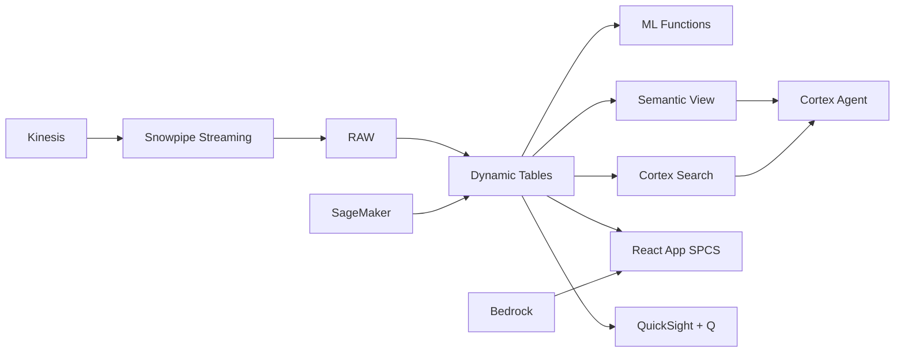

# Fintech Lending Analytics

Alternative credit scoring for Indonesia's 92M unbanked population — ML.FORECAST predicts repayment trajectories, Dynamic Tables build real-time loan portfolios, and Cortex AI generates collection strategies.

## Architecture

Indonesia has 92 million unbanked adults — the largest financial inclusion opportunity in Southeast Asia. A P2P fintech lender serves 3 million borrowers using alternative data for credit scoring (phone usage, e-commerce activity, social signals). With NPL trending toward OJK's 5% threshold and a deteriorating Q2 cohort, the CRO needs real-time portfolio visibility and ML-powered early warning — not monthly batch reports.



## Snowflake Capabilities

| Capability | Implementation |
|-----------|---------------|
| Dynamic Tables | PORTFOLIO_DASHBOARD / CREDIT_SCORE_FEATURES / VINTAGE_ANALYSIS / COLLECTION_STRATEGY |
| ML Functions | ML.FORECAST |
| Cortex AI | COMPLETE, AI_CLASSIFY, SUMMARIZE |
| Cortex Search | 50 documents indexed |
| Cortex Agent | LENDING_INTELLIGENCE_AGENT |
| Semantic View | LENDING_ANALYTICS |
| React App (SPCS) | 5 tabs + DemoGuide |


## AWS Services

| Service | Role in Demo |
|---------|-------------|
| Amazon Kinesis | Stream real-time repayment events and alternative data signals |
| Amazon SageMaker | Credit scoring models using alternative data features |
| AWS Glue | ETL for alternative data integration and feature engineering |
| Amazon Personalize | Personalized borrower engagement and product recommendations |
| Amazon Bedrock (Claude) | Generate collection strategies and regulatory compliance narratives |
| Amazon QuickSight + Q | Risk management dashboard with natural language queries |


## Personas

| Persona | Role | Key Questions |
|---------|------|---------------|
| **Adi Nugroho** | Chief Risk Officer | "What's our current NPL ratio by product?" "Which borrower segments have deteriorating credit quality?" |
| **Putri Maharani** | Credit Analytics Lead | "Which alternative data features best predict default?" "Show me the vintage curve for Q2 cohort." |


## Data

| Table | Rows | Description |
|-------|------|-------------|
| BORROWERS | 3,000,000 | Borrower profiles with demographics, alternative data, and credit scores |
| LOANS | 8,000,000 | Loan records with disbursement, repayment schedule, and status |
| REPAYMENTS | 50,000,000 | Individual repayment transactions with timing and amount |
| ALTERNATIVE_DATA | 10,000,000 | Phone usage, e-commerce activity, and social signals for scoring |
| COLLECTIONS | 2,000,000 | Collection activities, contact attempts, and resolution outcomes |
| REGULATORY_REPORTS | 50 | OJK regulatory submissions, audit reports, and compliance documentation |


## Build Instructions

### Prerequisites
- Snowflake account with ACCOUNTADMIN access
- Cortex AI enabled (ML Functions, Search, Agent)
- Warehouse: FINTECH_WH (Medium)
- AWS CLI with access (us-west-2)

### Deployment

```bash
snowsql -f snowflake/00_setup.sql
snowsql -f snowflake/01_marketplace_install.sql
snowsql -f snowflake/02_raw_tables.sql
snowsql -f snowflake/03_staging.sql
snowsql -f snowflake/04_dynamic_tables.sql
snowsql -f snowflake/05_search.sql
snowsql -f snowflake/06_ml_models.sql
snowsql -f snowflake/07_semantic_view.sql
snowsql -f snowflake/08_agent.sql
```

### React App (SPCS)
```bash
cd app && npm ci && npm run build
docker build -t aws-indonesia-digital-economy-fintech-app .
docker push bdiqc8sm-default.registry.snowflakecomputing.com/fintech_lending/app/aws_indonesia_digital_economy_fintech/app:latest
```

### Demo Mode
Open the app URL with `?demo=true` for presenter view.

## Build Modes

### Snowflake Only
Run scripts 00-08 (skip AWS-specific integration). Uses:
- **Snowpipe Streaming SDK** instead of Amazon Kinesis
- **ML.FORECAST + Cortex AI** instead of Amazon SageMaker
- **Dynamic Tables** instead of AWS Glue
- **Cortex Complete** instead of Amazon Personalize
- **Cortex Complete** instead of Amazon Bedrock (Claude)
- **Snowflake Intelligence (Cortex Analyst)** instead of Amazon QuickSight + Q

### Full AWS + Snowflake
Run all scripts including AWS integration. Deploy QuickSight dashboard from `quicksight/`.

## Business Impact

Industry research and Snowflake customer outcomes:
- **Indonesia has 92 million unbanked adults — second largest globally after India** — [World Bank Findex](https://www.worldbank.org/en/publication/globalfindex)
- **Indonesian P2P lending industry disbursed Rp 82 trillion in 2023 across 102 platforms** — [OJK](https://www.ojk.go.id/)
- **Alternative data scoring increases approval rates by 30-50% vs traditional bureau-only** — [CGAP](https://www.cgap.org/)
- **AI-optimized collections improve recovery rates by 20-35% in emerging market lending** — [McKinsey Banking](https://www.mckinsey.com/industries/financial-services/our-insights)
- **DoorDash** (Snowflake customer): processes 25M+ daily orders on Snowflake with ML-powered delivery optimization and marketplace analytics -- [snowflake.com/customers/doordash](https://www.snowflake.com/en/customers/all-customers/case-study/doordash/)

## Key Demo Numbers

- **3M borrowers** 92% previously unbanked
- **Rp 18T outstanding** loan portfolio across personal and productive loans
- **4.2% NPL** non-performing loan ratio (OJK threshold: 5%)
- **45 features** alternative data signals for credit scoring
- **87% collection** collection efficiency rate


## License

Apache 2.0 — See [LICENSE](LICENSE) for details.

This is a personal demo project and is not an official Snowflake offering. It comes with no support or warranty.