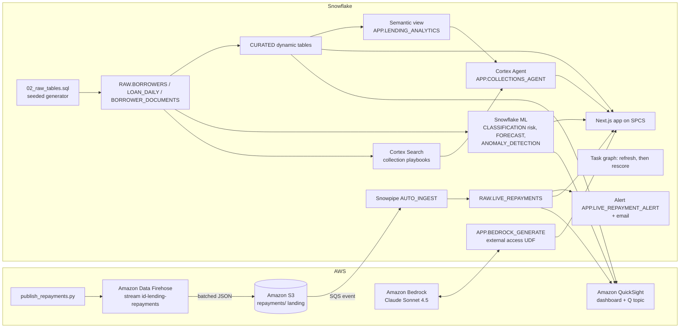

# Indonesia Digital Lending - Repayment Risk and Collections

End-to-end repayment monitoring for **200 borrowers of a fictional Indonesian digital lender across 5 cities** (Jakarta, Surabaya, Bandung, Medan, Makassar) using Snowflake, optionally with AWS: from a live missed-instalment event to a 14-day missed-instalment risk score, an alert email and an AI action memo for the risk team.

## Architecture

A lending-portfolio pipeline built on **Snowflake** (Dynamic Tables, Snowflake ML, Cortex Search, Cortex Agent, Cortex AI_COMPLETE, SPCS) and, in the full build, **AWS** (Amazon Data Firehose, S3, Bedrock Claude, QuickSight + Amazon Q). Repayment events land in `RAW.LIVE_REPAYMENTS`. Dynamic tables curate 90 days of borrower-day history across five loan products: instalments due and missed, on-time repayment rate, PAR 30, promise-to-pay rate and document coverage. Snowflake ML scores each borrower's probability of missing an instalment in the next 14 days, forecasts portfolio-wide missed instalments and flags e-wallet inflow drops. A Cortex Agent answers questions with collection-playbook citations, and an LLM drafts the risk action memo.

Interactive diagrams (hover for object names): [Snowflake only](docs/architecture-snowflake.html) | [AWS + Snowflake](docs/architecture-aws.html). The app shows both on its Architecture & Data tab, the current build first. Regenerate them with `python3 docs/build_architecture.py`.


```mermaid
flowchart LR
    subgraph AWS
      SIM[publish_repayments.py] --> FH[Amazon Data Firehose<br/>stream id-lending-repayments]
      FH -->|batched JSON| S3[(Amazon S3<br/>repayments/ landing)]
      BR[Amazon Bedrock<br/>Claude Sonnet 4.5]
      QS[Amazon QuickSight<br/>dashboard + Q topic]
    end
    subgraph Snowflake
      S3 -->|SQS event| PIPE[Snowpipe AUTO_INGEST] --> LIVE[RAW.LIVE_REPAYMENTS]
      GEN[02_raw_tables.sql<br/>seeded generator] --> RAW[RAW.BORROWERS / LOAN_DAILY / BORROWER_DOCUMENTS]
      RAW --> DT[CURATED dynamic tables]
      RAW --> ML[Snowflake ML<br/>CLASSIFICATION risk, FORECAST,<br/>ANOMALY_DETECTION]
      DT --> SV[Semantic view<br/>APP.LENDING_ANALYTICS]
      RAW --> CS[Cortex Search<br/>collection playbooks]
      SV --> AG[Cortex Agent<br/>APP.COLLECTIONS_AGENT]
      CS --> AG
      LIVE --> AL[Alert APP.LIVE_REPAYMENT_ALERT<br/>+ email]
      UDF[APP.BEDROCK_GENERATE<br/>external access UDF]
      TK[Task graph: refresh, then rescore]
      APP[Next.js app on SPCS]
    end
    BR <--> UDF
    DT --> APP
    ML --> APP
    LIVE --> APP
    AG --> APP
    UDF --> APP
    DT --> QS
    ML --> QS
    LIVE --> QS
```

The Snowflake-only build drops the AWS subgraph: `APP.SIMULATE_REPAYMENTS` writes to `RAW.LIVE_REPAYMENTS`, and the app calls Cortex `AI_COMPLETE` instead of the Bedrock UDF.

## Snowflake Capabilities

| Capability | Implementation |
|-----------|---------------|
| Dynamic Tables | `CURATED.KPI_SUMMARY`, `PERFORMANCE_SUMMARY`, `PRODUCT_SUMMARY`, `TREND_ANALYSIS` from the RAW tables |
| Snowflake ML | CLASSIFICATION 14-day missed-instalment risk (`ML.MISS_RISK_SCORES`), 14-day missed-instalment FORECAST, e-wallet inflow ANOMALY_DETECTION |
| Cortex Search | 15 synthetic collection playbooks (5 products x 3 delinquency stages) in `SEARCH.COLLECTION_SOP_SEARCH` |
| Semantic View | `APP.LENDING_ANALYTICS` over borrowers, products, daily totals and risk |
| Cortex Agent | `APP.COLLECTIONS_AGENT`: Cortex Analyst over the semantic view plus Cortex Search for playbook citations |
| Cortex AI | `AI_COMPLETE('claude-sonnet-4-5')` for grounded answers, and for the action memo in the Snowflake-only build |
| Alerts + Tasks | `APP.LIVE_REPAYMENT_ALERT` logs MISSED events and sends email; task graph `TASK_REFRESH_CURATED`, then `TASK_RESCORE_RISK` |
| Snowpark Container Services | Next.js app `APP.ID_LENDING_APP` with 6 tabs: Executive Cockpit, Predictive, Collections, Live Repayments, Ask AI, Architecture & Data |
| Snowpipe | `RAW.LIVE_REPAYMENTS_PIPE` AUTO_INGEST from S3 (AWS build only) |

## AWS Services

Used only in the AWS + Snowflake build.

| Service | Role in Demo |
|---------|-------------|
| Amazon Data Firehose | Direct PUT stream `id-lending-repayments` receives simulated instalment events and writes batches to S3 |
| Amazon S3 | Landing bucket (`repayments/`). An event notification goes to the Snowpipe SQS queue |
| Amazon Bedrock | Claude Sonnet 4.5 writes the action memo, called from Snowflake through an external-access UDF |
| Amazon QuickSight | DIRECT_QUERY executive dashboard over Snowflake (daily instalments, missed instalments by borrower, missed-instalment risk) |
| Amazon Q | Natural-language questions over the QuickSight topic `id-lending-topic` |
| AWS IAM | Least-privilege roles for S3, Firehose and Bedrock |

## Personas

These personas are fictional.

| Persona | Role | Key Questions |
|---------|------|---------------|
| **Ratna Wijaya** | Chief Risk Officer | "What is our on-time repayment rate and PAR 30?" "Which loan products are deteriorating?" |
| **Bayu Pratama** | Head of Collections | "Which borrowers are likely to miss an instalment in the next two weeks, and which playbook applies?" |

## Data

All data is synthetic and seeded, so every rebuild reproduces it. The lender, borrowers and names are fictional; the cities are real Indonesian cities used only as regions.

| Table | Rows | Description |
|-------|------|-------------|
| RAW.BORROWERS | 200 | Borrowers across 5 cities and 5 loan products (Paylater, Cash Loan, MSME Working Capital, Invoice Financing, Agri Productive), with a synthetic alternative-data score, principal (IDR) and a weekly or fortnightly instalment schedule |
| RAW.LOAN_DAILY | 18,000 | Daily borrower observations over 90 days: instalments due and missed, amounts due and paid (IDR), days past due, outstanding, collection contacts, promises to pay, e-wallet inflow and app sessions |
| RAW.BORROWER_DOCUMENTS | 200 | Required, on-file and pending underwriting documents per borrower |
| SEARCH.COLLECTION_DOCS | 15 | Synthetic collection playbooks indexed for Cortex Search |
| RAW.LIVE_REPAYMENTS | Grows during the demo | Live instalment events from Firehose (AWS build) or `APP.SIMULATE_REPAYMENTS` (Snowflake-only build) |
| ML.MISS_RISK_SCORES | 200 | 14-day missed-instalment probability and risk band per borrower |

## Build Instructions

### Prerequisites
- Snowflake account with ACCOUNTADMIN access, and Cortex AI enabled (AI_COMPLETE, Search, Agent).
- An X-Small warehouse with auto-suspend at or below 120 s, and an existing SPCS compute pool.
- Python 3.11+, `snowflake-connector-python`, Node.js 22+, Docker and the `snow` CLI.
- App image: create `APP.IMAGES` (`CREATE IMAGE REPOSITORY IF NOT EXISTS <DATABASE>.APP.IMAGES`), run `snow spcs image-registry login`, then build with `docker build --platform linux/amd64` and push `id-lending-app:v1` (see the header of `snowflake/07_deploy_app.sql`).
- AWS build only: `boto3`, AWS credentials for the target account (us-west-2) with Bedrock access, and QuickSight Enterprise.

### SPCS App
```
<DATABASE>.APP.ID_LENDING_APP
```

### Tests
```bash
python -m pytest aws snowflake quicksight
```

For a local run, put `SNOWFLAKE_ACCOUNT`, `SNOWFLAKE_USER`, `SNOWFLAKE_DATABASE`, `SNOWFLAKE_WAREHOUSE`, `SNOWFLAKE_AUTHENTICATOR=PROGRAMMATIC_ACCESS_TOKEN`, `SNOWFLAKE_TOKEN` and `DEMO_PLATFORM` in the environment, then run `npm --prefix app run build && npm --prefix app start`.

## Build Modes

Both modes share the same core. They differ in three places, and the app's `DEMO_PLATFORM` setting (in its SPCS spec) switches the memo provider and the Live Repayments tab.

| Layer | Snowflake Only | Full AWS + Snowflake |
|---|---|---|
| Live repayments | `CALL APP.SIMULATE_REPAYMENTS(n)` inserts simulated instalment events into `RAW.LIVE_REPAYMENTS`. This simulates a repayment feed; it is not Snowpipe Streaming | `aws/publish_repayments.py` to Amazon Data Firehose, then S3, SQS and Snowpipe AUTO_INGEST |
| Action memo | Cortex `AI_COMPLETE('claude-sonnet-4-5')` | Amazon Bedrock Claude Sonnet 4.5 through `APP.BEDROCK_GENERATE` |
| BI and natural-language questions | The SPCS app is the dashboard; questions go to the Cortex Agent | Also a QuickSight dashboard and an Amazon Q topic |
| App setting | `DEMO_PLATFORM: snowflake` | `DEMO_PLATFORM: aws` |

### Snowflake Only

```bash
# 1. Core data and dynamic tables (guarded: new isolated database only)
python snowflake/run_core.py --database INDONESIA_LENDING_SNOWFLAKE --warehouse <XS_WAREHOUSE> --connection <CONNECTION> --apply
# 2. Native repayment feed, ML, search, semantic view, agent, alert and task graph
python snowflake/run_intelligence.py --database INDONESIA_LENDING_SNOWFLAKE --platform snowflake --warehouse <XS_WAREHOUSE> --connection <CONNECTION> --alert-email you@example.com
# 3. App on SPCS with DEMO_PLATFORM=snowflake (push the image first)
python snowflake/run_intelligence.py --database INDONESIA_LENDING_SNOWFLAKE --platform snowflake --warehouse <XS_WAREHOUSE> --connection <CONNECTION> --alert-email you@example.com --files 07_deploy_app.sql --compute-pool <COMPUTE_POOL>
```

During the demo:
- Run `CALL APP.SIMULATE_REPAYMENTS(20)` to add live repayment events. For a continuous feed, run `ALTER TASK APP.TASK_SIMULATE_REPAYMENTS RESUME`, and `SUSPEND` it afterwards.
- Run `EXECUTE ALERT APP.LIVE_REPAYMENT_ALERT` to raise the alert email.
- Run `EXECUTE TASK APP.TASK_REFRESH_CURATED` to refresh the curated tables and rescore risk.

Afterwards, drop the database or run `ALTER SERVICE APP.ID_LENDING_APP SUSPEND`.

### Full AWS + Snowflake

```bash
# 1. Core data and dynamic tables (guarded: new isolated database only)
python snowflake/run_core.py --database INDONESIA_LENDING_AWS --warehouse <XS_WAREHOUSE> --connection <CONNECTION> --apply
# 2. AWS ingestion and Bedrock (dry run first, then --apply)
python aws/setup_aws.py --database INDONESIA_LENDING_AWS --account <AWS_ACCOUNT_ID> --connection <CONNECTION> --apply
# 3. ML, search, semantic view, agent, alert and task graph
python snowflake/run_intelligence.py --database INDONESIA_LENDING_AWS --platform aws --warehouse <XS_WAREHOUSE> --connection <CONNECTION> --alert-email you@example.com
# 4. App on SPCS with DEMO_PLATFORM=aws (push the image first)
python snowflake/run_intelligence.py --database INDONESIA_LENDING_AWS --platform aws --warehouse <XS_WAREHOUSE> --connection <CONNECTION> --alert-email you@example.com --files 07_deploy_app.sql --compute-pool <COMPUTE_POOL>
# 5. QuickSight dashboard and Q topic (needs an existing Snowflake data source)
python quicksight/build_dashboards.py --database INDONESIA_LENDING_AWS --account <AWS_ACCOUNT_ID> --principal-arn <QUICKSIGHT_USER_ARN> --data-source-arn <DATA_SOURCE_ARN> --prefix id-lending --apply --update --with-topic
```

QuickSight objects must be shared with the QuickSight user who signs in (`--principal-arn`); otherwise the console shows nothing.

During the demo:
- Run `python aws/publish_repayments.py --count 20` to send live repayment events. Firehose buffers for up to 60 seconds before writing to S3.
- Run `EXECUTE ALERT APP.LIVE_REPAYMENT_ALERT` to raise the alert email.
- Run `EXECUTE TASK APP.TASK_REFRESH_CURATED` to refresh the curated tables and rescore risk.

Afterwards, `python aws/teardown_aws.py --database INDONESIA_LENDING_AWS --account <AWS_ACCOUNT_ID> --connection <CONNECTION> --apply` removes the AWS resources and the account-level Bedrock external-access and S3 storage integrations. It leaves the email integration `ID_LENDING_EMAIL_INT`, which the Snowflake-only build also uses.

## Business Impact

Industry research and Snowflake customer outcomes:
- **1.3 billion adults still lack access to financial services**, while nearly 80% of adults worldwide now have a financial account; about 900 million adults without an account have a mobile phone, including 530 million with smartphones -- [World Bank press release, Global Findex 2025](https://www.worldbank.org/en/news/press-release/2025/07/16/mobile-phone-technology-powers-saving-surge-in-developing-economies)
- **Sallie Mae** (Snowflake customer, student lending) cut its current expected credit loss (CECL) calculation time from 16 hours to two, grew data volumes from 100TB to over 600TB without increasing warehouse spend, and sends a follow-up email within 15 minutes when someone abandons a loan application -- [Snowflake customer story: Sallie Mae](https://www.snowflake.com/en/customers/all-customers/case-study/sallie-mae/)

## Key Demo Numbers

These figures are synthetic and come from the seeded demo data. Forecast and anomaly figures can shift slightly with the build day.

- **200 borrowers** across 5 cities and 5 loan products; 18,000 borrower-days over 90 days; IDR 3.0 bn outstanding on the latest day
- **1,918 instalments due** and **297 missed**, so the on-time repayment rate is 84.5%; IDR 2.35 bn collected
- **PAR 30 is 7.0%** of outstanding; Invoice Financing has the highest PAR 30 (9.8%) and MSME Working Capital the lowest on-time rate (79.2%)
- **Makassar** has the lowest on-time repayment rate of the 5 cities (82.9%), after a 15-day regional income shock in the data
- **Missed-instalment model** out-of-time holdout: precision 0.34, recall 0.22 at a 0.5 threshold, against a 0.21 base rate. 28 borrowers are high risk; the top borrower is BRW-0145, at 98.2%
- **14-day missed-instalment forecast** with prediction intervals; **147 e-wallet inflow drops** flagged across 25 borrowers in the last 15 days
- **850 collection contacts** with a 45.9% promise-to-pay rate; document coverage 59.0%, with 114 documents pending
- **15 playbooks** indexed for Cortex Search and cited by ID in agent answers

## License

Apache 2.0 — See [LICENSE](LICENSE) for details.

This is a personal demo project and is not an official Snowflake offering. It comes with no support or warranty. Industry metrics cited are from publicly available third-party research and Snowflake customer stories; they represent reported outcomes and are not guarantees of results.
